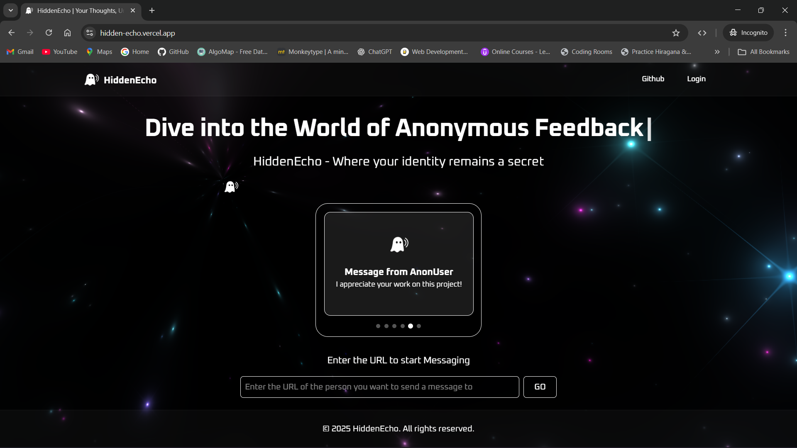
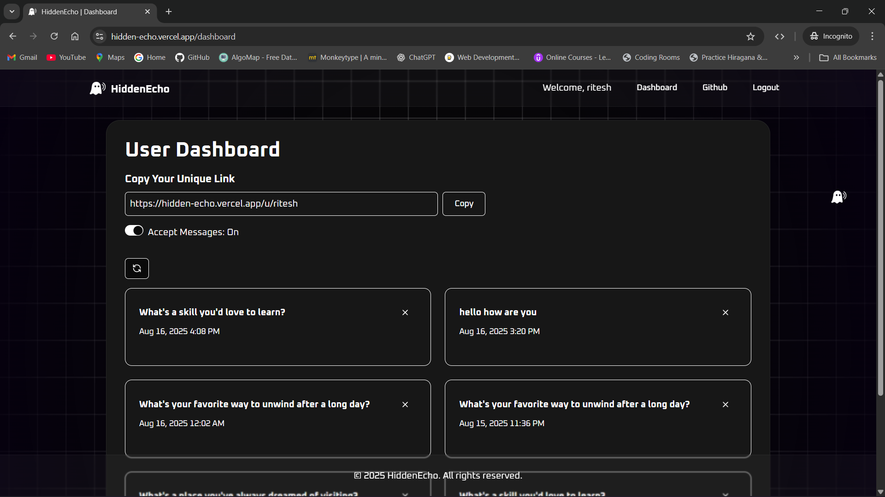
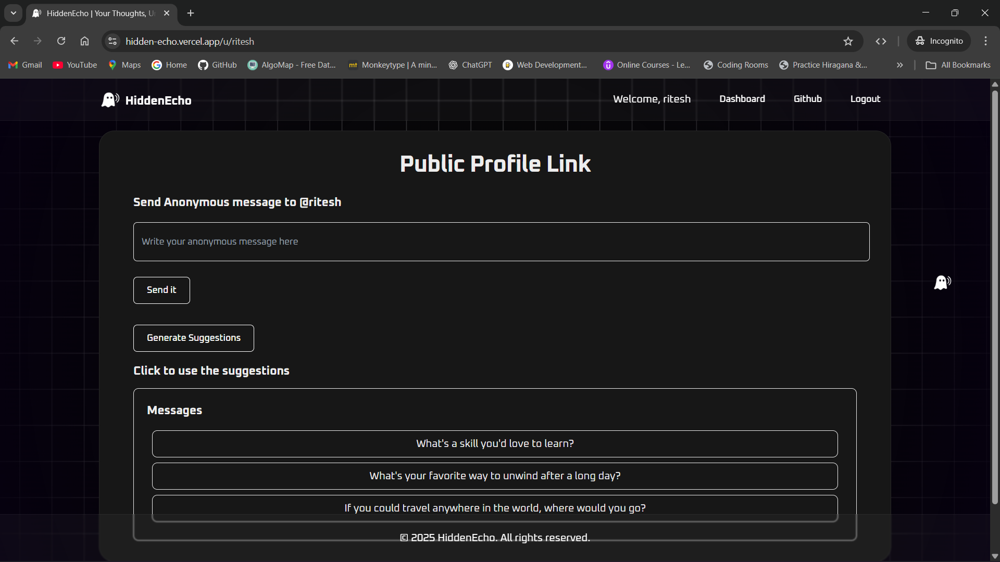

# HiddenEcho

HiddenEcho is a modern **anonymous feedback platform** built with
[Next.js](https://nextjs.org/) and powered by a full-stack
implementation.\
It allows users to send and receive feedback anonymously in a secure,
responsive, and user-friendly way.

This project showcases advanced **Full-Stack Web Development skills**
--- including authentication, database integration, custom UI, and
deployment readiness.

------------------------------------------------------------------------

## ✨ Features

-   🔒 **Authentication & Authorization** with
    [NextAuth.js](https://next-auth.js.org/)
-   📝 **Anonymous feedback system** with secure message handling
-   🎨 **Custom UI components** built using [React
    Bits](https://reactbits.dev/) & Tailwind CSS
-   📱 **Responsive design** (mobile-first, works seamlessly across
    devices)
-   🌙 **Dark/Light mode** support with `next-themes`
-   🎥 **Smooth animations** using GSAP and Motion
-   📧 **Email integration** with Resend & React Email
-   📂 **MongoDB integration** with Mongoose for data storage
-   ⚡ **Optimized performance** with Next.js (App Router & Turbopack)
-   🖼️ **Custom favicon & branding** for a professional look


------------------------------------------------------------------------

## 🌐 Live Demo

[Click here](https://hidden-echo.vercel.app/)

------------------------------------------------------------------------


## 🛠️ Tech Stack

-   **Frontend:** Next.js 15, React 19, Tailwind CSS 4, React Bits,
    GSAP, Motion
-   **Backend:** Next.js API Routes, MongoDB, Mongoose
-   **Authentication:** NextAuth.js
-   **Forms & Validation:** React Hook Form, Zod
-   **Email Service:** Resend, React Email
-   **UI Components:** Radix UI, Lucide Icons, React Bits


------------------------------------------------------------------------

## 🚀 Getting Started

### 1️⃣ Clone the Repository

``` bash
git clone https://github.com/your-username/hiddenecho.git
cd hiddenecho
```

### 2️⃣ Install Dependencies

``` bash
npm install
```

### 3️⃣ Setup Environment Variables

Create a `.env.local` file in the root with the following:

``` env
MONGODB_URI=your_mongodb_connection_string
NEXTAUTH_SECRET=your_secret_key
NEXTAUTH_URL=http://localhost:3000
RESEND_API_KEY=your_resend_api_key
GOOGLE_API_KEY=your_google_gemini_api_key

```

### 4️⃣ Run the Development Server

``` bash
npm run dev
```

App will be live on: <http://localhost:3000>

### 5️⃣ Build for Production

``` bash
npm run build
npm start
```


------------------------------------------------------------------------

## 🖼️ Preview

### Landing Page


### User Dashboard


### User Public Profile
 


------------------------------------------------------------------------

## 📚 License & Disclaimer

This project is licensed under the **MIT License**.

© 2025 HiddenEcho. Made for **educational purposes only**.\
Built with the help of tutorials, including YouTube resources.\
 [Tutorial Link
Here](https://youtube.com/playlist?list=PLu71SKxNbfoBAaWGtn9GA2PTw0HO0tXzq&si=LUS3wX_QbaV7Xz0G)

------------------------------------------------------------------------

## 💡 Want to Contribute?

Contributions, issues, and feature requests are welcome!  
Feel free to fork the repository and submit a pull request.


------------------------------------------------------------------------

## 👨‍💻 Author

Developed by **Ritesh Verma** ✨\
 [Linked In](https://www.linkedin.com/in/ritesh-verma-b30855325/)\
 [Email](riteshvermamt@gmail.com)

